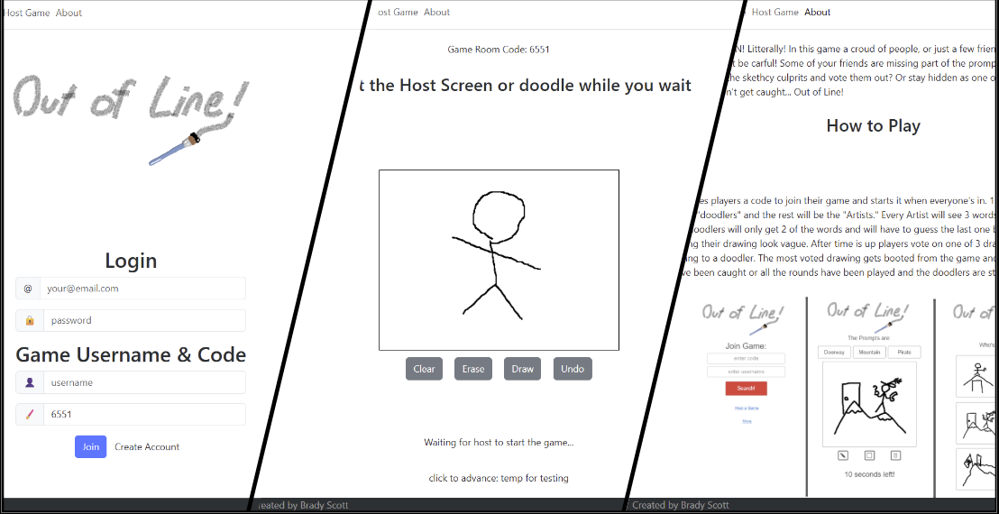
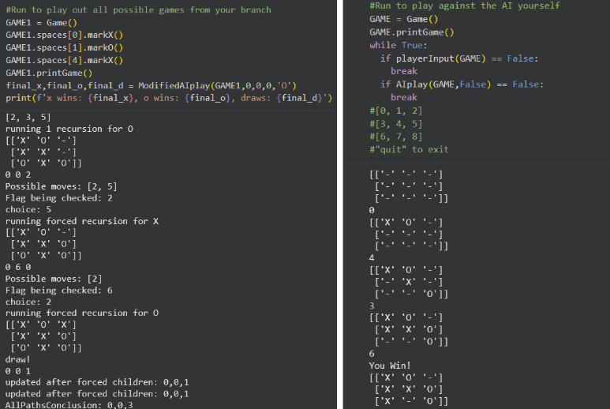
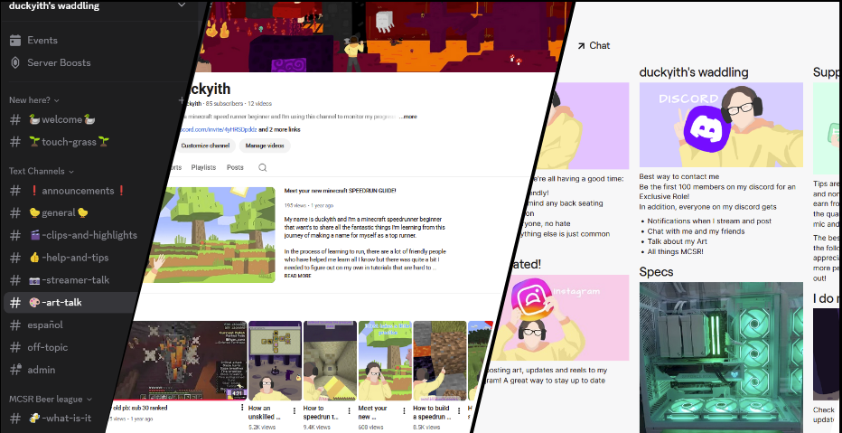

# username: duckyith
Programmer, game developer (Provo, UT • (808) 940-2292 • bradyith@gmail.com)

LinkedIn and Github
- https://www.linkedin.com/in/brady-scott-914074385/
- https://github/duckyith

The purpose of this website is to track and display my progress in projects and provide my background. I started as a scratch coder making silly games years ago and dabbled in some python. Following a major switch a couple years ago for Computer science I have since imporved my programming skills dramatically and wanted to start tracking my progress and monitering my projects. I love solving all sorts of problems with code but game making (board or video games) has always been the side I'm most passionate about. I plan to soon (after I get a little bit more experience and time) make my own game and in the meantime, graduate from BYU learning as much as I can along the way.

## React website

https://startup.outofline.click
- multiplayered web game: Out Of Line
- Game where a group of players draw from prompts and then vote on imposters
- Hosted on a server provided by AWS
- Began with just html pages
- added CSS
- Reformatted to React
- Added JavaScript Functionality
- Planned to use Services, Websockets and APIs to improve
- Currently in active development

Github with ReadMe for more info on React Website game + projects
- https://github.com/duckyith/startup
- Code history and extensive break down in Repository

## Tic Tac Toe Experiment

https://github.com/duckyith/ticTacToeExperiment
- practice with object oriented code
- Question: when playing against an AI that will always see forced moves but otherwise plays random, what is the optimal way to play
- Build TicTacToe game in Python (Google Colab)
- Built AI to play against
- Made a modified AI that plays it self in all possibilities from a given state and reports number of wins, losses and ties
- Includes ReadMe with analysis
- Plans to make more advanced AI that will report best path from a state

## Content Creation side project

Minecraft Speedrunning, video editing
- https://www.youtube.com/@duckyith
- https://www.twitch.tv/duckyith
- https://discord.gg/PB9kCufB
- Saw a need for easy to undertand, all in one place begginner tutorials for speedrunning minecraft (something I was passionate about and had trouble finding)
- Made a twitch, youtube, discord platform and grew to 100 followers on twitch with a few regulars and 10k views on my best video (not particularly impressive but for a quick side project for fun I'm proud of the progress I made and the platforms I built)
- Never finished all of my tutorials but I still get messages from players who need help and plan to return some day
- also worked on a speedrun mod for a bit that is also unfinished and I would like to return to

## All Relevent Job experience

Resident Assistant – BYU Housing (most recent)
Aug 2024 – Apr 2025 | Provo, UT
- Mentored freshman students living on campus
- Identified, assessed, reported on, planned for and executed small- and large-scale activities to address the needs of the residents
- Acted as a mediator for contentious residents

Teacher’s Assistant – BYU Physics & Astronomy
Jan 2024 – Apr 2024 | Provo, UT
- Programmed and operated planetarium star shows (Digistar & ZEISS systems).
- Guided students through labs, demos, and telescope imaging.
- Gained experience troubleshooting and managing complex technical systems for shows

Missionary, The Church of Jesus Christ of Latter-day Saints
Jun 2020 – May 2022 | Bogotá, Colombia
- Processed and managed visas, passports, and flights for 170+ international representatives as Migrations Secretary.
- Developed strong organizational, cross-cultural communication, and problem-solving skills.
- Became fluent in Spanish.

Intern – US Synthetic (diamond drill bit insert manufacturing company)
Jan 2019 – May 2019 | Orem, UT
- Utilized CAD and 3D modeling skills in engineering project to improve corrosion resistance

## Educational Background

Brigham Young University — B.S. in Computer Science (in progress)
Aug 2022 – Present | GPA: 3.0
Relevant Coursework: Data Structures & Algorithms, Operating Systems, Software Engineering, Computer Architecture, Linear Algebra, Physics

Kahuku High and Intermediate School — Kahuku, Hawaii
2016 – 2020

Provo High School — Provo, Utah (1-year sabbatical Junior Year)
2018-2019
